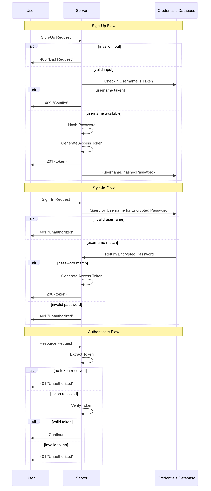
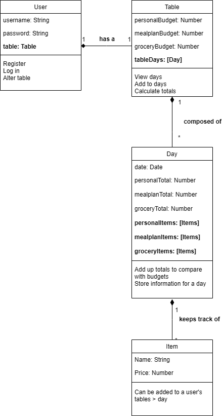

# FoodLife
An innovative new app that tracks dining plans and monthly budgets for money-conscious adults and college students.

To get the Repo up and running on your own device:

1. Git clone the repository
2. In the root of the monorepo, run "npm install"

Code should work as expected afterwards. Tested with copying my backend/frontend folders from my CSC-307 app, no further installs needed (since npm install installs all the already "added" modules in the project skeleton files)

## Access Control Sequence Diagram

## Class Diagram

## Link To Docs
See docs [here](/docs)
